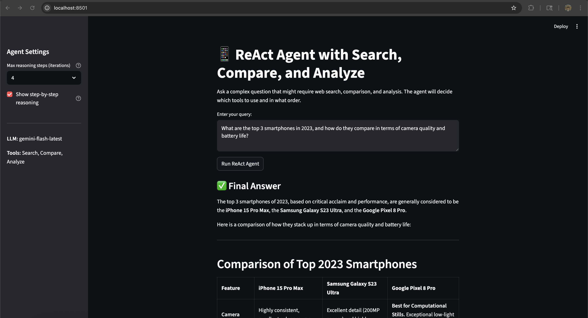
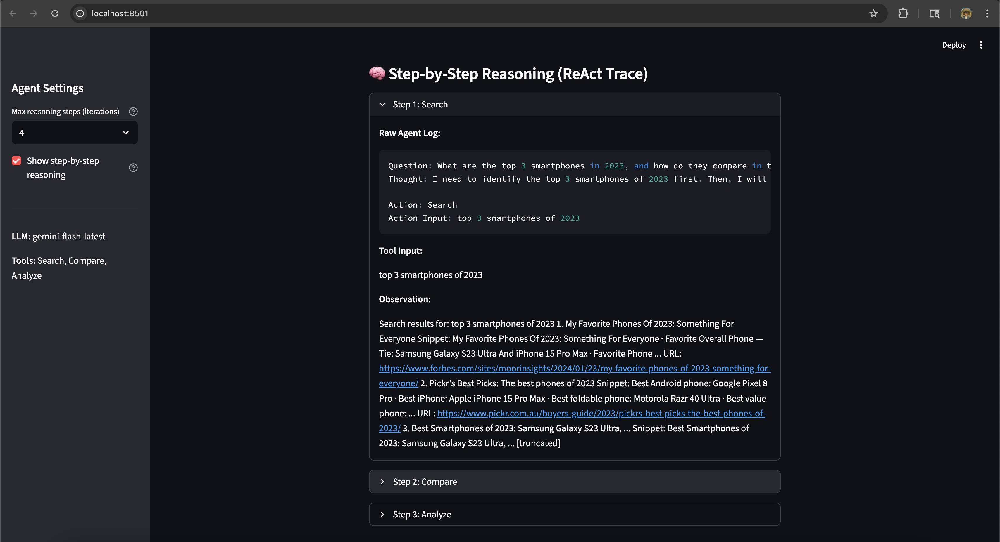
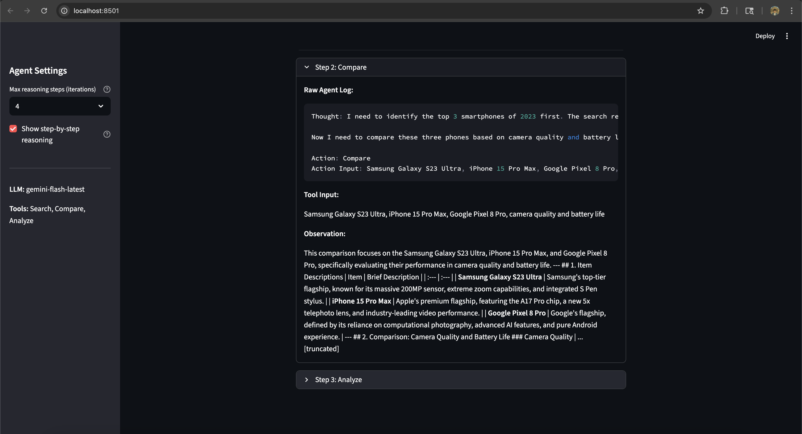
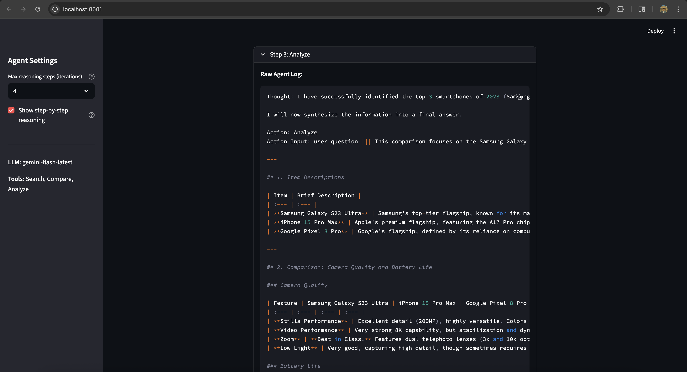

# ReAct Agent with Multiple Tools

This project implements a **ReAct (Reasoning + Acting)** agent that combines reasoning and tool use to handle complex queries. The agent uses LangChain and Google's Gemini model to orchestrate three custom tools: Search, Compare, and Analyze.

## About ReAct Agents

ReAct agents follow a pattern where they alternate between reasoning steps and taking actions (tool calls). This approach, introduced by Yao et al. (2022), allows language models to:
- Reason about what information they need
- Decide which tools to use
- Interpret tool outputs
- Synthesize a final answer

The agent dynamically chooses which tools to use and in what order based on the query, making it capable of handling complex, multi-step tasks.

## Features

The implementation includes:

### 1. **Search Tool**
Uses SerpAPI to search the web and format results as a numbered list with titles, snippets, and URLs. The formatted results are optimized for consumption by the ReAct agent.

### 2. **Compare Tool**
A custom LangChain tool that compares multiple items along a specified category. It accepts input in the format: `item1, item2, ..., category` and uses the LLM to generate a structured comparison with recommendations.

### 3. **Analyze Tool**
Summarizes and extracts key information from search results or comparisons. It can work with raw text or accept additional context in the format: `user question ||| text to analyze`.

### 4. **ReAct Agent Integration**
Uses LangChain's `initialize_agent` with `AgentType.ZERO_SHOT_REACT_DESCRIPTION` to orchestrate the three tools. The agent reasons about which tool to use next and how to interpret results.

### 5. **Streamlit UI**
A user-friendly interface for interacting with the agent, including:
- Natural-language query input
- Configurable maximum reasoning steps
- Final answer display
- Optional step-by-step reasoning trace

## Project Structure

- `react_agent.ipynb` - Jupyter notebook with the complete implementation and examples
- `app.py` - Streamlit application for interactive use
- `requirements.txt` - Python dependencies

## Installation

1. Install dependencies:
```bash
pip install -r requirements.txt
```

2. Set up API keys:
   - `GOOGLE_API_KEY` - For Google Gemini API
   - `SERPAPI_API_KEY` - For SerpAPI web search

   You can set these in your environment or create a `.env` file:
   ```
   GOOGLE_API_KEY=your_key_here
   SERPAPI_API_KEY=your_key_here
   ```

## Usage

### Running the Streamlit App

From the project directory:

```bash
streamlit run app.py
```

Then open the URL that Streamlit prints (typically `http://localhost:8501`).

### Using the Notebook

Open `react_agent.ipynb` in Jupyter to explore the implementation, run examples, and see detailed reasoning traces.

## How It Works

The agent follows the ReAct pattern:

1. **Thought**: The agent reasons about what it needs to do
2. **Action**: It selects a tool (Search, Compare, or Analyze) and provides inputs
3. **Observation**: The tool returns results
4. **Repeat**: The agent continues this cycle until it can provide a final answer

Example trace:
```
Thought: I need to find information about top smartphones first
Action: Search[top smartphones 2023]
Observation: [Search results about top smartphones]
Thought: Now I should compare the top options
Action: Compare[iPhone 15 Pro, Samsung Galaxy S23 Ultra, Pixel 8 Pro, camera quality]
Observation: [Comparison result]
Thought: I should analyze this comparison for the user
Action: Analyze[comparison result]
Observation: [Analysis of the comparison]
Final Answer: [Agent's final response]
```

## Screenshots

### Homepage
The main UI with query input, configuration options, and results display.



### Search Tool in Action
An example where the agent calls the Search tool first to gather information.



### Compare Tool Trace
The agent uses the Compare tool to compare multiple items along a category.



### Analyze Tool Trace
The agent uses the Analyze tool to summarize and produce a final recommendation.



## References

Yao, S., Zhao, J., Yu, D., Du, N., Shafran, I., Narasimhan, K., & Cao, Y. (2022). ReAct: Synergizing reasoning and acting in language models. arXiv preprint arXiv:2210.03629.

